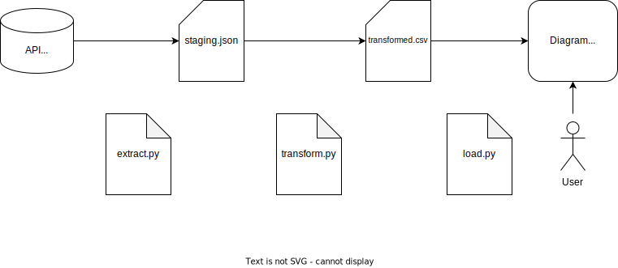

## What will we do?
Create a simple ETL process:

1. Load data from a public REST API
2. Add a simple transformation
3. Visualize the data

## Why are we doing that?
As a data worker, it is important to understand ETL (Extract, Transform, Load) because it is the process of gathering data from various sources, transforming it into a format suitable for analysis, and loading it into a target system. This process is critical for ensuring data accuracy and consistency, as well as making data usable for downstream applications. Understanding ETL also enables data engineers to optimize data pipelines and identify and resolve issues that may arise during the data integration process.

## Setup
1. Install Python 3 [**[Instruction](https://realpython.com/installing-python/)**]

## System and data overview
1. **Data Source**: REST API with Fruit Data
2. **Data Transformation**: Python Script to bring the JSON data in a visualization ready format
3. **Data Sink**: Visualization chart

