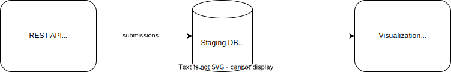

## Difficulty
Intermediate

## What will you learn?
1. Setup a local environment with Docker and connect services
2. Interaction with Metabase as visualization tool
3. Setup PostgreSQL and insert some data

## What will we do?
Create a simple ETL process:

1. Load jokes data from a public REST API Pusshift
2. Ingest data into PostgreSQL as staging layer
3. Visualize the data with Metabase

## Why are we doing that?
As a data worker, it is important to understand ETL (Extract, Transform, Load) because it is the process of gathering data from various sources, transforming it into a format suitable for analysis, and loading it into a target system. This process is critical for ensuring data accuracy and consistency, as well as making data usable for downstream applications. Understanding ETL also enables data engineers to optimize data pipelines and identify and resolve issues that may arise during the data integration process.

## Setup
1. Install Python 3 [**[Instruction](https://realpython.com/installing-python/)**]
2. Install Docker [**[Instruction](https://docs.docker.com/engine/install/)**]
3. Clone the repository: [**[GitHub Repository](https://github.com/HelleGazelle/blog-projects/tree/master/002-reddit-jokes)**]

## System and data overview
1. **Data Source**: Pusshift REST API with Reddit data
2. **Data Extraction**: Python Script for loading data into PostgresQL
3. **Data Sink**: PostgreSQL

